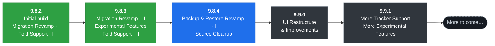

<div align="center">

# Yomu Re:Dive

**A foldable-first, free and open-source manga reader for Android.**

Yomu Re:Dive is a fork of [Kotatsu-Redo](https://github.com/Kotatsu-Redo/Kotatsu-Redo) (which
itself builds on [Kotatsu](https://github.com/KotatsuApp/Kotatsu)). It keeps the full Kotatsu
reader and layers on a foldable-focused experience, a reworked manga-migration flow, and a set of
opt-in experimental features.


[](LICENSE)
[](https://github.com/NoMoreMora/Yomu-Redive/releases/latest)

</div>

## Why Yomu Re:Dive?

This fork focuses on things the upstream apps don't emphasise. Everything else is inherited from
Kotatsu (see [below](#inherited-from-kotatsu)).

- **Foldable-first reading** — a side-by-side two-page spread that engages automatically in book
  posture (unfolded, vertical hinge), posture awareness (book / tabletop / folded), seamless
  continuous-reader flow and **per-screen zoom** that survive folding and unfolding.
- **Migration, reworked (TachiyomiSY-style)** — batch-migrate favourites with large cover-forward
  cards, a per-row menu, a target-source dropdown, and a migration options sheet (what data to
  carry, hide filters, advanced search, match by chapter number).
- **Experimental features** (Settings → Developer options) — on-device **auto-translate
  descriptions**, a **webtoon resume fix**, exportable debug logs, all opt-in.
- **Reading quality-of-life** — **hide partial chapters** (`.5`-style), sort Favourites by unread
  count, and more.
- **Source curation** — 13 MangaReader clones consolidated into **MangaK.io** (with an NSFW toggle);
  sources build from the [yomu-redive-parsers](https://github.com/NoMoreMora/yomu-redive-parsers)
  fork so they can be tweaked while still tracking upstream.
- **Fewer nags** — a global **"Show CAPTCHA notifications"** toggle (off by default).
- **In-app updates** — direct from GitHub Releases, with **Stable** and **Development** channels.

## Roadmap



**Legend:** 🟢 released · 🔵 in progress · ⚫ planned · ⚪ future. Roadmap items are goals, not
promises, and may shift.

## Download

Grab the latest APK from the [**Releases**](https://github.com/NoMoreMora/Yomu-Redive/releases)
page, or let the app update itself:

- **Stable** channel — plain-numbered releases (e.g. `9.8.3`).
- **Development** channel — also receives `-beta` pre-releases. Switch in **Settings → About →
  Update channel**.

Yomu Re:Dive installs under its own application id (`io.github.yomuredive.yomu`), so it sits
**side-by-side** with upstream Kotatsu / Kotatsu-Redo without conflicts.

## Inherited from Kotatsu

Yomu Re:Dive is a full Kotatsu reader, so it also includes everything upstream provides — 1200+
online sources with search and filters, favourites organised by category, reading history,
bookmarks and incognito mode, offline downloads (plus third-party CBZ), a Material You UI, a
customizable standard/webtoon reader, new-chapter notifications and recommendations, tracker
integration (Shikimori, AniList, MyAnimeList, Kitsu), app-lock, cross-device sync, and support for
Android 6.0+.

For the complete feature set and general documentation, see the upstream projects:
[**Kotatsu-Redo**](https://github.com/Kotatsu-Redo/Kotatsu-Redo) and
[**Kotatsu**](https://github.com/KotatsuApp/Kotatsu).

## Building

```bash
./gradlew assembleDebug
```

The debug build installs under `io.github.yomuredive.yomu.debug` (installable alongside the
release). See [FORK.md](FORK.md) for build-environment notes, the release-signing setup, and the
custom-sources (parser fork) workflow.

## Fork changes & attribution

- [**FORK.md**](FORK.md) — full lineage, attribution, and per-change implementation notes.
- [**CHANGELOG.md**](CHANGELOG.md) — what shipped in each version.

The internal source namespace (`org.koitharu.kotatsu`) is intentionally unchanged to keep upstream
merges clean.

## Contributing

Pull requests are welcome — see [CONTRIBUTING.md](CONTRIBUTING.md). Contributions to the general
reader are usually best directed upstream to
[Kotatsu-Redo](https://github.com/Kotatsu-Redo/Kotatsu-Redo) /
[Kotatsu](https://github.com/KotatsuApp/Kotatsu); this repo focuses on the fork-specific work above.

## License

[](https://www.gnu.org/licenses/gpl-3.0.en.html)

Yomu Re:Dive is licensed under the **GNU GPLv3**. You may copy, distribute and modify the software
as long as you track changes/dates in source files. Any modifications to — or software including
(via compiler) — GPL-licensed code must also be made available under the GPL along with build &
install instructions. Yomu Re:Dive builds on the work of the Kotatsu project and its contributors;
see [FORK.md](FORK.md) for the full lineage.

## DMCA disclaimer

The developers of this application do not have any affiliation with the content available in the
app, and do not store or distribute any content. This application should be considered a web
browser; all content found through it is freely available on the Internet. All DMCA takedown
requests should be sent to the owners of the website where the content is hosted.
